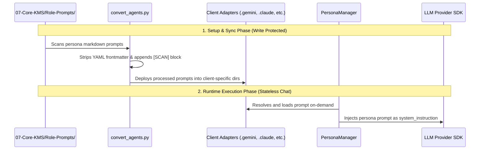

# 🏛️ Bastien-Antigravity: Functional & Architectural Analysis

This document provides a deep functional analysis of the core paradigms that ensure the `obsidian-brain` orchestrator is a **solid, modular, and reliable framework**. It explains role lifecycles, configuration states, access controls, system dynamics under change, and how the entire ecosystem operates on a **mergeable layered model** analogous to UnionFS/OverlayFS.

Additionally, this document contains a detailed **Failure Mode & Effects Analysis (FMEA)** outlining concrete, programmatic solutions to prevent system, security, and behavioral problems.

---

## 🗺️ Conceptual Overlay: The UnionFS / OverlayFS Paradigm

The Bastien-Antigravity ecosystem maps directly to the principles of a union filesystem (OverlayFS, UnionFS, AUFS). Instead of presenting a flat, unstructured repository, the workspace is conceived as a set of **unified, mergeable conceptual layers** stacked on top of each other:

```
  ┌──────────────────────────────────────────────────────────┐
  │         MergedDir (Unified Context View via MCP)          │
  └────────────────────────────┬─────────────────────────────┘
                               │ (Exclusion Filter / Firewall)
                               ▼
  ┌──────────────────────────────────────────────────────────┐
  │   UpperDir (Read-Write Workspaces & Experiments)          │  <- Sibling Repos / 04-Fluid
  ├──────────────────────────────────────────────────────────┤
  │   MidDir (Frozen Behavioral specs)                       │  <- 02-Business-BDD (Frozen)
  ├──────────────────────────────────────────────────────────┤
  │   LowerDir (Read-Only Base Systems & Architecture Rules) │  <- 07-Core-KMS / 03-Tech-Stack
  └──────────────────────────────────────────────────────────┘
```

### 1. The LowerDir (Immutable Base Layer)
- **Components**: `07-Core-KMS` (Prompts, Personas, Workflows) and `03-Tech-Stack` (Coding standards, ADRs).
- **Behavior**: This is the foundation. During execution sessions, this layer is set to **read-only** at the OS level (`chmod 444/555`). The AI cannot write to or mutate its own core operating directives.

### 2. The MidDir (Contract Specification Layer)
- **Components**: `02-Business-BDD` (Frozen Gherkin Specs).
- **Behavior**: This layer defines the behavioral source of truth. Under strict modes (Spec-First), it acts as a frozen layer. The AI reads this spec as an immutable requirement contract to dictate code generation.

### 3. The UpperDir (Mutable Workspace Layer)
- **Components**: Sibling repositories (Fleet microservices) and `04-Rapid-Prototyping` (Labs).
- **Behavior**: This is the read-write scratchpad/workspace where the active development takes place. This is the only layer where code files are generated, edited, and verified.

### 4. The MergedDir (Unified Context Graph via MCP)
- **Components**: Model Context Protocol (`obsidian_rag` or `obsidian_vault` filesystem server).
- **Behavior**: The MCP server acts as the union mount point. It merges the lower, middle, and upper directories into a single navigable filesystem graph. The AI agent sees a unified virtual directory tree containing standard rules, behavioral specs, and local implementations.
- **Whiteouts (Exclusions)**: Mode firewalls (`global_excludes` and `mode_excludes_map`) function like OverlayFS whiteout markers. Depending on the active mode (Spec-First vs. Labs), specific sub-directories (like `01-Strategic-Nexus` or other microservices) are masked/hidden from the AI's merged view.

---

## 🎭 Persona Roles: Loading, Configuration, and Rights

The system treats AI agents as modular personas. Their configurations, prompts, and permissions are decoupled from the main launcher code.



### 1. How Roles are Configured and Loaded
- **Source Configuration**: Each persona is defined as a directory inside `07-Core-KMS/Role-Prompts/` (e.g., `05-DocMaintainer`). It contains:
  - A primary `Prompt-<Name>.md` file with Markdown documentation of its role, duties, and tools.
  - A `Wisdom-Log.md` acting as a persistent feedback loop where the agent logs accumulated wisdom over sessions.
- **The Sync Pipeline**:
  - The script `convert_agents.py` acts as the compiler. It reads the source markdown files, strips local frontmatter, wraps them in client-compatible frontmatter, appends the **State Management Rule** and the mandatory **[SCAN] Attention Restoration Block**, and writes them to `.gemini/agents/`, `.claude/agents/`, `.deepseek/agents/`, and `.codex/agents/`.
- **OOP Loading**: Inside `src/managers/persona.py`, `PersonaManager.load_prompt(persona_name)` performs this parsing dynamically, generating the system prompt for runtime completion.

### 2. Rights Management (Access Control)
Rights are governed by a dual-enforcement mechanism:
- **System Permissions (OS-Level)**: During the engine startup, `GovernanceManager.manage_kms_permissions(protect=True)` performs a recursive `chmod 555/444` on `07-Core-KMS` and `00-AI-Orchestration`, preventing the AI from modifying its own directives or mutating logs. On loop pause, it is unlocked (`chmod 755/644`) to allow updates.
- **Application Permissions (Access Control Matrix - ACM)**:
  - For RAG, the configuration is stored in `09-RAG-Engine/access_matrix.yaml`.
  - The MCP server enforces these rules on all read/write file operations (`_check_permission()` in `server.py`), strictly blocking file modifications based on file extensions (markdown vs source code) and the active mode profile.

### 3. How to Interact with Personas (Services vs CLIs)
Interaction is designed to be highly modular and support multiple entry-points:
- **Web UI Service (`ui.py`)**: A local web application built on Chainlit. It mounts the `EngineFacade` and exposes a chat interface. It acts as a local web service where incoming messages are fed to the `EngineFacade`'s memory pipeline and routed to the provider.
- **CLI Chat Wrapper**: Procedural CLI loops (launched via `start_squad.py`) that invoke native executable wrappers (Gemini SDK/CLI) pointing to the compiled adapter folders.
- **Model Context Protocol (MCP)**: Future-facing modularity allows exposing the personas as MCP tools themselves, letting external orchestrators call specific subagents (e.g., `call_qa_agent(code)` or `call_architect_agent(design)`) as modular micro-services.

---

## 🔌 System Dynamics & Fallback Under Modifications

A truly solid base must maintain integrity and remain functional when core modules are added, removed, or changed.

### 1. What happens if NO RAG is attached?
- **Detection**: The facade checks for `09-RAG-Engine` and its `server.py` file using `check_rag_attached()`.
- **Decoupled Swap**: If RAG is absent, `MCPManager.configure_mcp()` skips registering the `obsidian_rag` MCP server in the global settings.
- **Standard Fallback**: It automatically falls back to registering `obsidian_vault` using the standard, official `@modelcontextprotocol/server-filesystem` MCP server.
- **Directory Isolation**: It dynamically resolves the workspace paths, excludes the protected folders (`global_excludes` and the active mode's exclusions), and mounts the allowed workspace folders.
- **Result**: The system remains 100% functional. The AI simply switches from querying a semantic vector store to using direct filesystem search and read tools, ensuring zero downtime.

### 2. What happens if we introduce a NEW Business-BDD specification?
- **Auditing Integrity**: On session start, `Sovereignty` run-preflights re-index the workspace. The new spec file (`.md` or `.feature`) is added to the `valid_paths` and `valid_stems` lookup indexes.
- **Enforcement**: In Spec-First mode (Mode 1), the Access Controller (`AccessController.is_path_allowed`) restricts modifications. The AI is forced to read this spec file as a read-only source of truth (Frozen).
- **Implementation Mapping**: The developer persona loads the spec from the context, generates the matching code in the target microservice, and calls the testing command defined in the BDD mapping.

### 3. What happens if we add a NEW Tech Stack?
- **Structure**: If a new folder is added (e.g., `03-Tech-Stack/08-Rust-Standard/`), it represents a new architectural blueprint.
- **Context Injection**: 
  - If RAG is active: The vector index automatically parses and chunks the new files, making them searchable via semantic queries.
  - If RAG is absent: The filesystem MCP mounts the new folder.
- **Agent Alignment**: The Architect and Developer personas are prompt-instructed to query `03-Tech-Stack` documents before writing code. The moment the new rules are placed in the stack folder, the AI adopts the new rules (e.g., coding style, dependencies) in its completion outputs without requiring modifications to the main orchestrator code.

---

## 🛡️ Vulnerabilities, Failure Modes & Prevention (Stopping Problems)

To guarantee that this architecture remains resilient, we must address potential security loopholes, structural design weaknesses, and failure points.

### 1. OS-Level Permission Escape (Shell Command Bypass)
- **Problem**: The AI agent is given shell execution capabilities (via workflow `shell` actions or tool calls). A malicious or hallucinating agent could execute `chmod 777` or `sudo chmod` commands on the workspace to bypass the `07-Core-KMS` read-only lock.
- **Prevention**: 
  - The runtime environment executing the shell commands must run in a sandboxed, unprivileged user process.
  - In production, write protection for the core directives (`LowerDir`) should be enforced at the virtualization layer (e.g., mounting `07-Core-KMS` as a **read-only Docker Volume**) rather than relying solely on OS-level `chmod` commands which can be reversed by the running container.

### 2. Settings Overwrite Collision (Parallel & Crash Failure)
- **Problem**: The settings backup mechanism in `main.py` creates a single `.bak` file. 
  - If two sessions are launched concurrently, the second session will backup the already-modified configuration file, permanently losing the user's original settings.
  - If the script crashes abruptly (e.g., a SIGKILL or power outage), the original settings are never restored, leaving the system modified.
- **Prevention**:
  - Implement dynamic, session-keyed backups: `settings.json.bak-<session_id>`.
  - Use file-locking mechanisms to prevent concurrent writes to settings.
  - Transition to an **MCP Gateway/Proxy** model: Instead of rewriting global config files on disk, run a local proxy that intercepts MCP requests and routes them to the correct local server dynamically based on environment variables, leaving global config files completely static.

### 3. Exclusions Firewall Leakage (Credentials & Token Bloat)
- **Problem**: When RAG is inactive, the standard filesystem MCP exposes the entire workspace root. If a developer places private credentials (`.env` files, SSH keys, or cloud configs) in the vault or sibling repository roots, the AI can read them, leaking sensitive data or inflating the token context.
- **Prevention**:
  - Implement a strict, hardcoded blacklist in [src/core/security.py](../src/core/security.py) and [src/core/mcp.py](../src/core/mcp.py) that automatically intercepts any access attempt to files matching: `.env`, `*.pem`, `id_rsa`, `config.json`, `.git`, or `node_modules`, regardless of the active Mode or workspace configuration.

### 4. Behavioral Drift in BDD Spec Execution
- **Problem**: In Spec-First mode (Mode 1), the AI can generate code that drifts from BDD spec specifications because there is no automated validation mapping the Gherkin steps directly to the written code modules.
- **Prevention**:
  - Integrate a structural parser within the Sovereignty engine that checks if the scenarios defined in the Gherkin files in `02-Business-BDD` are mapped to valid test step definitions in the `sandbox-testing` suite.
  - Enforce that the Preflight check runs this matching check, blocking task completion if steps are unmapped.

### 5. Contradictory Stack Rules (Rule Collision)
- **Problem**: A new tech stack standard may contradict an existing tech stack standard (e.g., conflicting naming conventions, contradicting folder hierarchies), leading to AI confusion and erratic code outputs.
- **Prevention**:
  - Establish a strict precedence order for tech stack files.
  - Add a linter in the preflight phase that checks for conflicting rules across directories (e.g., identifying duplicate definitions for the same language standards).

### 6. Stateless Memory Disconnection in UI
- **Problem**: Refreshing the browser or restarting the Chainlit server resets the user's active session, causing the AI to lose the current context, even if the database contains the history.
- **Prevention**:
  - Persist the active session ID in a local cache or write it to [00-AI-Orchestration/AI-Session-State.md](../00-AI-Orchestration/AI-Session-State.md).
  - On UI initialization, check the session file for the active `Mission-ID` and automatically restore the corresponding conversation history from the SQLite database.

### 7. Sibling Repo Direct Commits (Bypassing Governance)
- **Problem**: Sibling code repositories reside in the mutable "UpperDir". A developer or AI could commit and push changes directly inside a sibling repository, bypassing the Sovereignty preflight checking and BDD validations entirely.
- **Prevention**:
  - Enforce git hooks on all sibling repositories (using `install_git_hooks.py` during workspace indexing) that trigger the `Sovereignty` audit check on `pre-commit` and `pre-push` events, blocking git transactions if the repository or specs are dirty or invalid.
