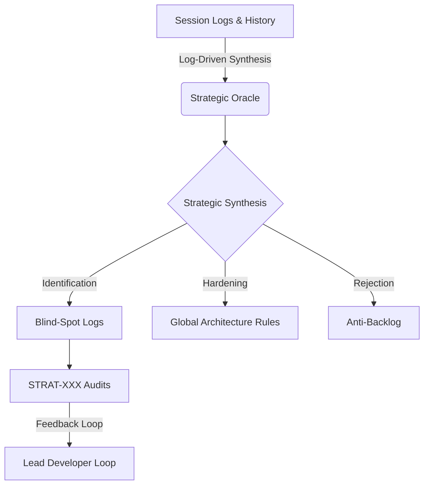

---

microservice: nexus-strategic-brain
type: architecture
status: active
tags:
- '#zone/3-fleet'
- '#ai/ignore'
- '#service/nexus-strategic-brain'
---
# 🛰️ Strategic Nexus: Architecture Overview

The **Strategic Nexus** (Internal ID: `nexus-strategic-brain`) serves as the **Meta-Intelligence Layer** and **Strategic Oracle** for the Bastien-Antigravity ecosystem. It is designed to prevent "Architectural Amnesia" and combat "Execution-First Drift" by synthesizing project history into actionable strategic directives.

## 🏗️ Structural Philosophy

Unlike execution-focused microservices, the Strategic Nexus operates as a **Reflective Loop**. It does not process market data; it processes **Project Intent and Reasoning**.

### 1. The 3-Tier Strategic Stack
1.  **Observational Tier**: Continuous monitoring of session logs, commit history, and developer decision-making patterns.
2.  **Synthesis Tier**: High-level analysis of "The Why" behind architectural shifts (recorded in `STRAT-XXX` audits).
3.  **Prescriptive Tier**: Generation of "Global Laws" and "Anti-Backlog" entries to guide future development and prevent recurring technical debt.

## 🧩 Core Components

### 👁️ Strategic Audits (`STRAT-XXX`)
Formal reports that identify "Blind Spots" and "Infrastructure Gordian Knots." These documents act as the primary interface between the Oracle and the Lead Developer.

### 🚫 The Anti-Backlog
A specialized knowledge base of **Conscious Rejections**. By documenting why a feature or pattern was NOT implemented, the Nexus prevents "Zombies" (rejected ideas that keep coming back) and preserves architectural purity.

### 🧩 Strategic Patterns
Identification of ecosystem-specific success and failure patterns. This component codifies "What always works" in this specific polyglot environment (Go/Rust/Python/C++).

## 🌀 Operational Data Flow

## 🔗 Integration Points

- **Role Alignment**: The Nexus is hard-linked to the `Chronos-Oracle` role prompt, ensuring that the AI agent maintaining this repo maintains a "high-altitude" perspective.
- **Fleet Governance**: Findings from the Nexus directly influence the `fleet-manager.py` audit rules and the global `Ecosystem-Map-MOC`.
- **Knowledge Management**: Operates as **Zone 0 (Strategic)** in the 5D Knowledge Paradigm, acting as the root of all structural reasoning.

## 🛡️ Sovereignty & Rituals
The Nexus enforces the **Sovereignty Ritual** (`STRAT-005`), requiring mandatory architectural sign-offs before major infrastructure pivots, ensuring that execution never outpaces strategic understanding.

